# Decisions

Answers to the eight things the brief asks for, in order. Short on purpose —
every trade-off written out in full is in [ARCHITECTURE.md](ARCHITECTURE.md).

**What it does:** upload your CV, paste in job postings, and for each one get a
fit score, the skills you're missing, how your experience lines up, and what to
prepare for the interview.

## Contents

- [Demo video](#demo-video)
- [Screenshots](#screenshots)
- [a. Quick setup](#a-quick-setup)
- [b. Architecture overview](#b-architecture-overview)
- [c. Productionising and scaling](#c-productionising-and-scaling)
- [d. LLM approach and decisions](#d-llm-approach-and-decisions)
- [e. Key technical decisions](#e-key-technical-decisions)
- [f. Engineering standards](#f-engineering-standards)
- [g. How I used AI tools](#g-how-i-used-ai-tools)
- [h. What I'd do differently with more time](#h-what-id-do-differently-with-more-time)

The long-form version of every trade-off is in
[ARCHITECTURE.md](ARCHITECTURE.md).

---

## Demo video

[Resume Job Compatibility Matcher (AWS Deployed).mp4](demos/Resume%20Job%20Compatibility%20Matcher%20%28AWS%20Deployed%29.mp4)

Recorded against the AWS deployment: registration, CV upload straight to S3,
the worker ingesting it, the trace in X-Ray, then job postings scored and
ranked.

---

## Screenshots

### Authentication

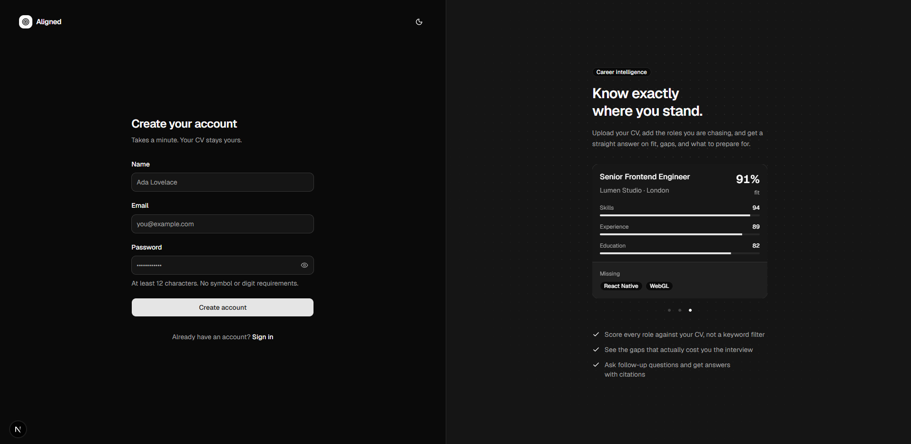
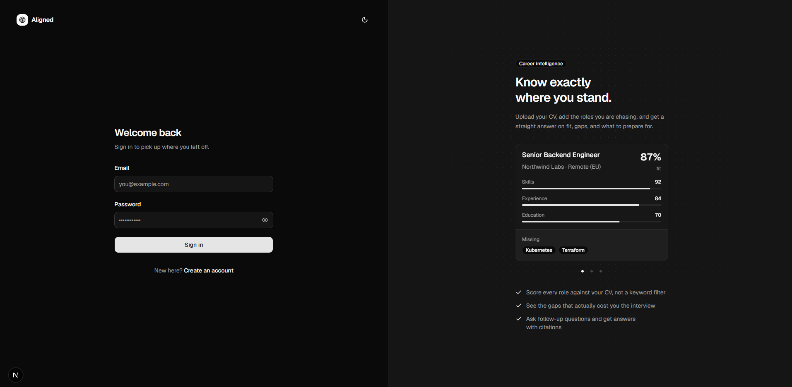

### Onboarding

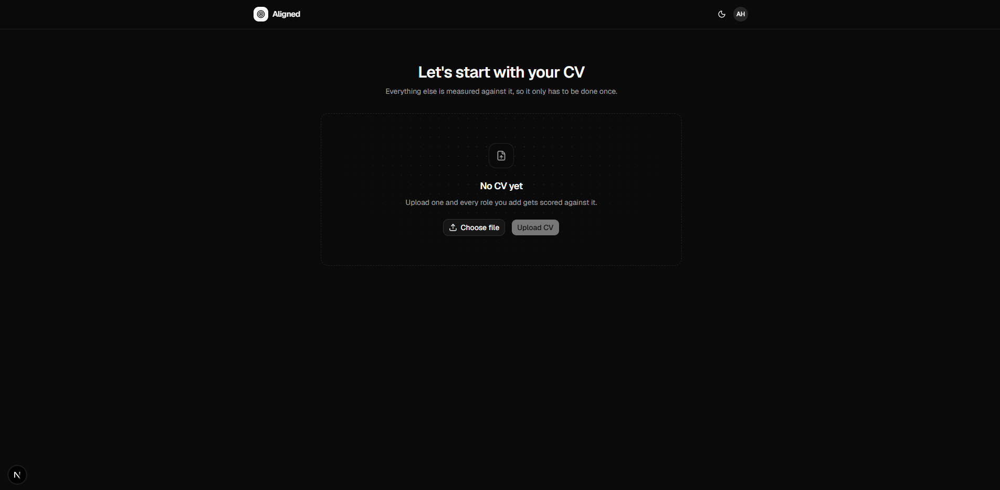

### Dashboard

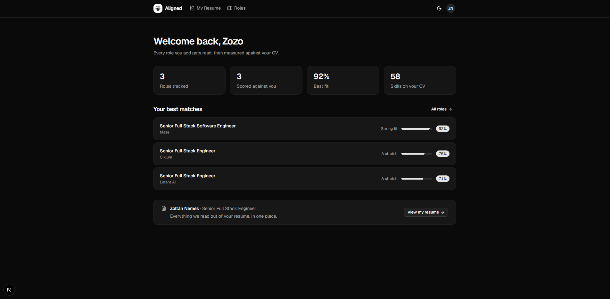

### My Resume

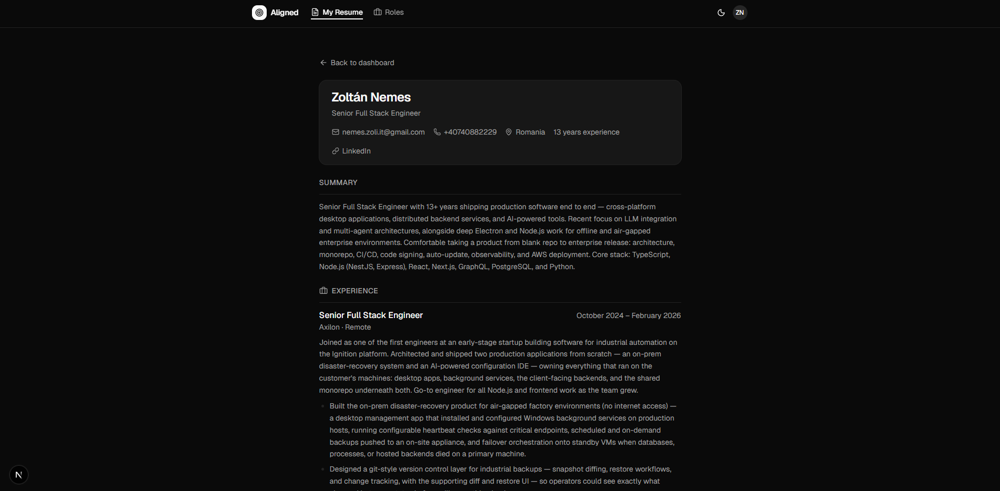
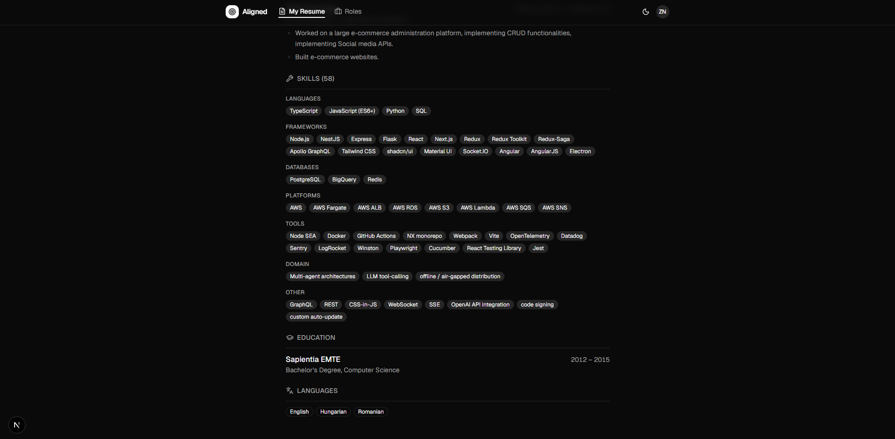

### Jobs list

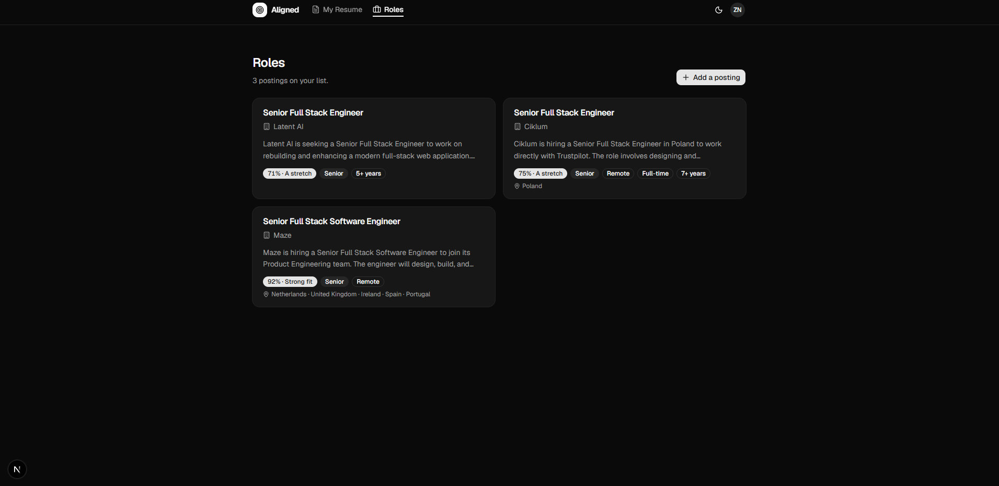

### Job details

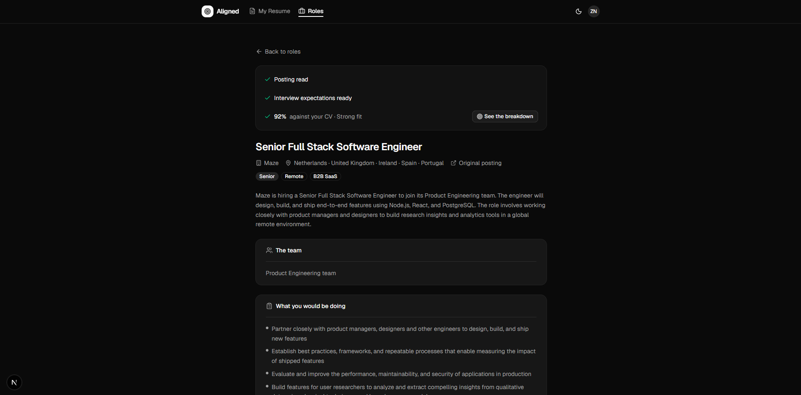
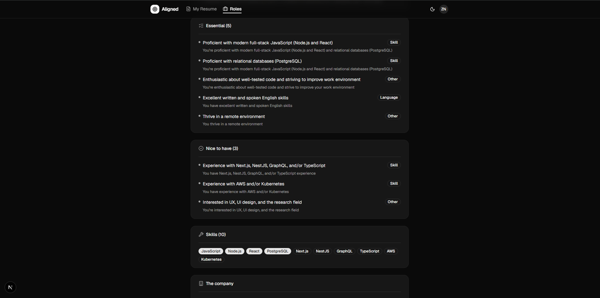
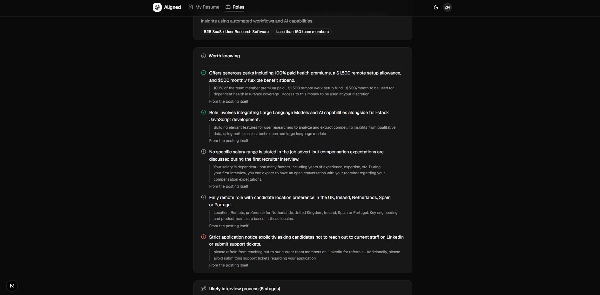
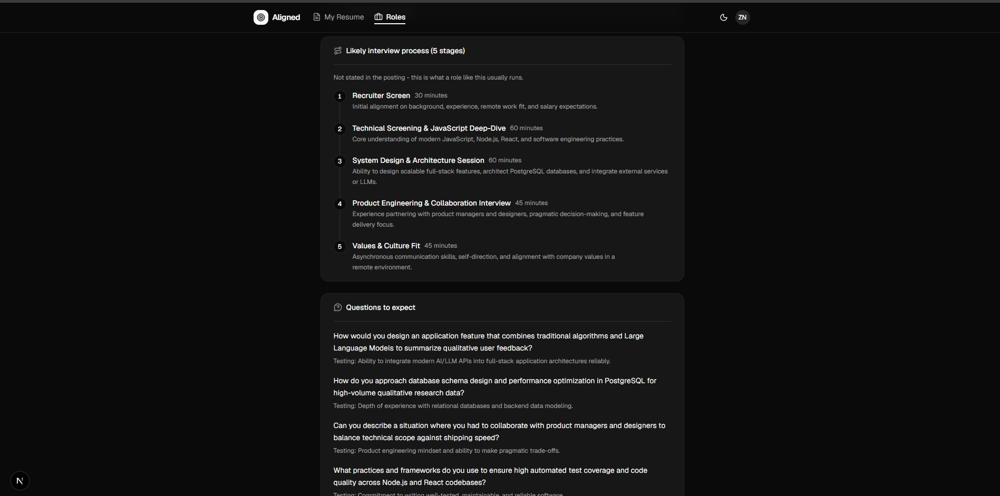

### Job matching

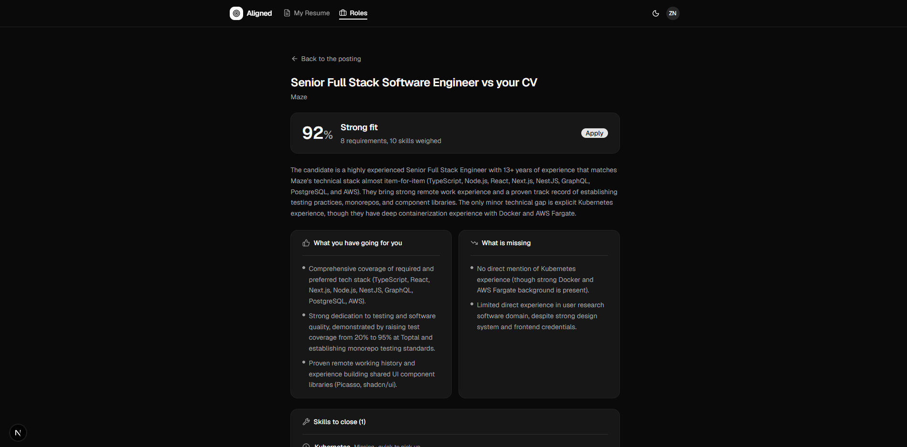
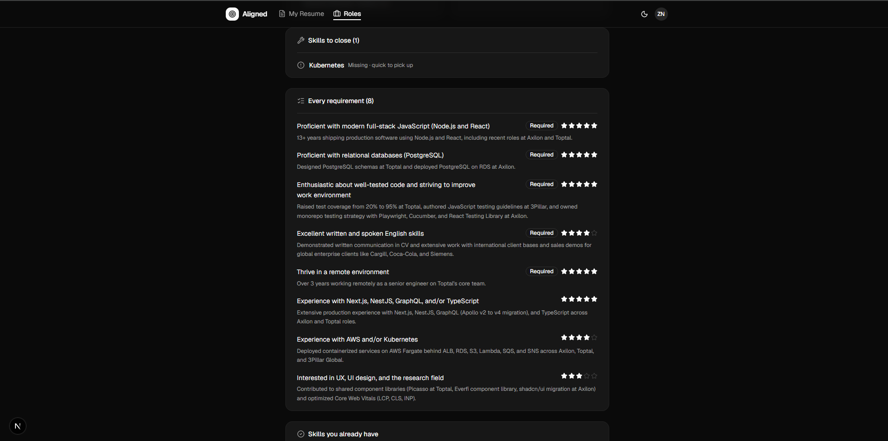
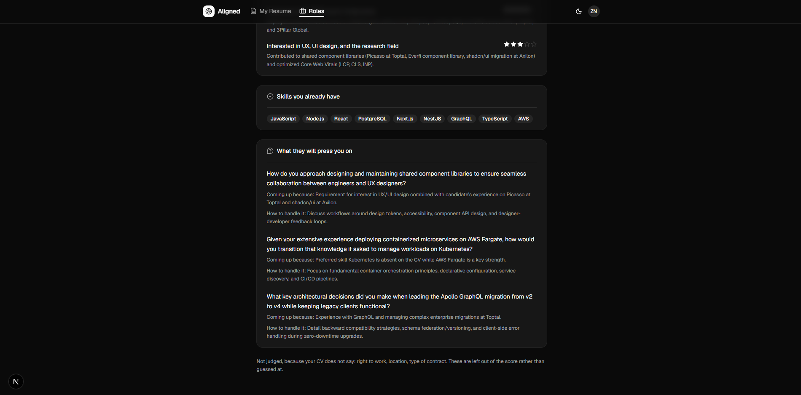

### Tracing

One posting, end to end in X-Ray. The API answers in 83ms; the two Gemini calls
behind it take 13.5s and 21.4s in the worker.

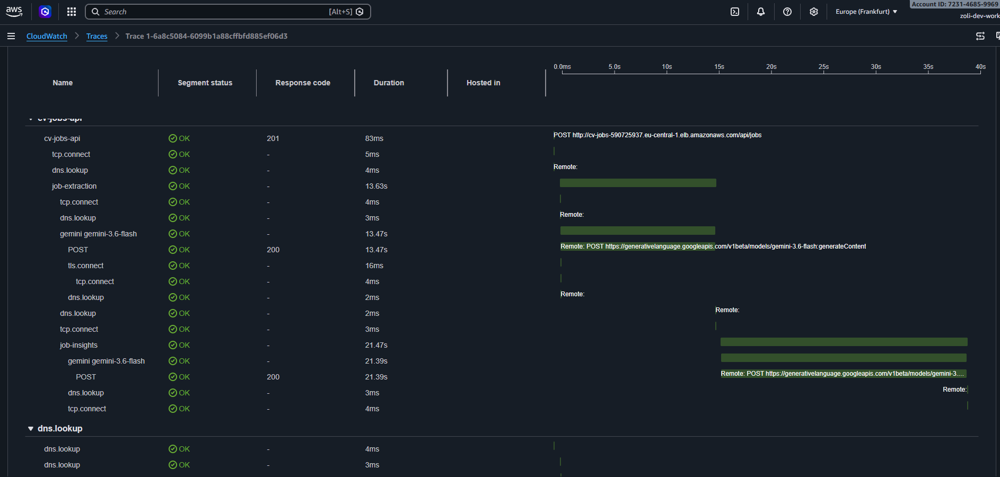

---

## a. Quick setup

Full instructions are in the [README](README.md). The short version:

```bash
pnpm install
cp apps/api/.env.example apps/api/.env     # add a Gemini API key
cp apps/web/.env.example apps/web/.env
docker compose up -d                        # Postgres + MinIO
pnpm --filter @cv-jobs-compatibility/api run db:migrate
pnpm dev
```

Web on `:3000`, API on `:4000`. You need a free
[Gemini API key](https://aistudio.google.com/apikey) — no card required.

For deploying to AWS, see [infra/README.md](infra/README.md).

---

## b. Architecture overview

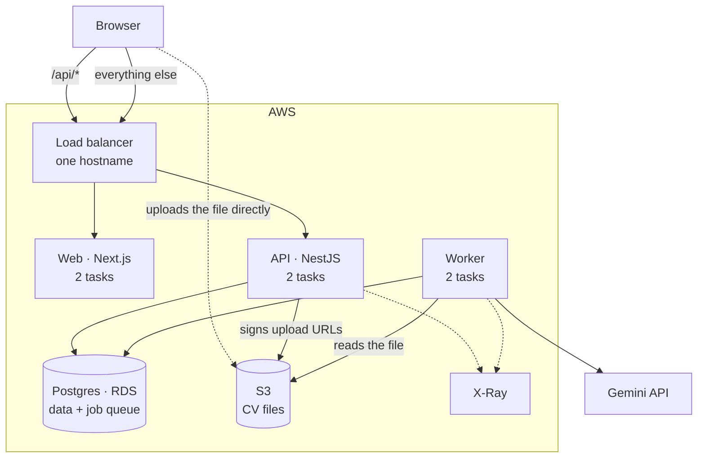

Two ideas shaped everything else.

**The file never touches the API.** The browser asks for a signed URL, uploads
straight to S3, then tells the API it's done. The API handles the paperwork,
never the bytes. No upload size limit at the load balancer, no memory used per
upload.

**The slow work isn't in the request.** Parsing a CV is an LLM call taking 15–30
seconds. That can't happen while someone waits on HTTP. So the upload writes a
row, queues a job, and returns. A separate worker does the real work and the page
polls until it's done.

Upload flow:

1. Browser asks the API for an upload URL
2. Browser uploads the file to S3 itself
3. Browser tells the API the upload finished
4. API writes a row and queues a job — **in one transaction**
5. Worker picks it up, pulls the file, calls Gemini, saves the parsed CV

Step 4 is the reason the queue lives in Postgres. The row and its job are written
together or not at all. With a separate broker, queueing could fail after the row
was saved, and that CV would sit forever with nothing coming to process it.

### The stack

| | Choice | Why |
| --- | --- | --- |
| Repo | Nx monorepo, pnpm | One commit changes the API, the web app and the types they share |
| API | NestJS | Structure I don't have to invent |
| Web | Next.js, App Router | Server rendering, builds to a small container |
| UI | Tailwind, shadcn | Components live in my repo, so I can change them |
| Database | Postgres 17, Drizzle | I wanted to keep writing SQL and reviewing migrations |
| Queue | pg-boss | A table in the same Postgres. No broker to run |
| Files | S3, MinIO locally | MinIO speaks the same API, so local and deployed code match |
| LLM | Google Gemini | Free tier, structured JSON output, no card to start |
| Auth | JWTs in httpOnly cookies, hand-rolled | One login method didn't justify a library |
| Tracing | OpenTelemetry → X-Ray | The app only speaks OTLP; the destination is config |
| Deploy | ECS Fargate, ALB, RDS | Containers without managing servers |
| Infra | Terraform | Checked in, and one command tears it all down |

---

## c. Productionising and scaling

It is already deployed — ECS Fargate behind a load balancer, RDS, S3, Terraform,
2 API + 2 web + 2 worker tasks, CPU autoscaling. Recorded, then destroyed. See
[the demo](demos/) and [infra/README.md](infra/README.md).

**What's still missing before real users:**

| | |
| --- | --- |
| TLS | The AWS account I had couldn't issue a certificate. Needs ACM plus a domain — no application change |
| Session revocation | See (e). A session table |
| Connection pooling | RDS Proxy or PgBouncer, so tasks share a pool instead of each opening its own |
| Rate limiting | Login and register answer as fast as password hashing allows |
| CI/CD | Images build on my machine from a script. Nothing runs on push |
| Structured logs and metrics | Tracing is in; logging is plain text and no metrics are published |
| Backups, multi-AZ | Turned off deliberately for a stack destroyed the same day |

**Where it breaks, in order.** Nothing was load tested; this is arithmetic from
configured values.

1. **The LLM, not the infrastructure.** Every handler is `batchSize: 1` and
   pg-boss's `localConcurrency` defaults to 1, so each worker runs **one job per
   queue at a time**. Four queues — CV extraction, job extraction, job insights,
   job matching — means a worker can have four jobs in flight, but only one of
   each kind. For CV uploads that is two at a time across the deployment.
   Throughput is however fast Gemini answers, times two — and in the
   [trace above](#tracing) that was 13.5s and 21.4s per call. The levers are
   more worker tasks or raising `localConcurrency`.

2. **pg-boss — not close.** A couple of jobs in flight means the queue is doing
   single-digit queries per second. It handles hundreds to low thousands. Orders
   of magnitude of headroom, which is the whole reason not to run a broker.

**When I'd move to Redis or SQS:** not for throughput — that argument doesn't
arrive until thousands of jobs/sec. It would be because the queue should stay up
when Postgres doesn't, or because the data outgrew one database. The cost of
moving is losing the transactional enqueue in step 4 above; getting that back
means an outbox table and a relay, which is more machinery than pg-boss is.

---

## d. LLM approach and decisions

**Model: Google Gemini Flash.** Considered OpenAI and Anthropic. Gemini won on a
usable free tier, native structured output, and long context — a CV plus a job
posting fits with room to spare. The model name is pinned, never an alias like
`-latest`, because every extraction stores the model that produced it and that
record is worthless if the name quietly means something else next month.

**Embedding model and vector database: none, deliberately.** RAG solves not
being able to fit your corpus in the context window. A CV and a job posting both
fit whole, and chunking them would throw away the structure that carries the
meaning — "5 years at this company" means nothing split from its dates. Right at
this size, wrong once someone has hundreds of saved postings to search across.
That's when pgvector goes in; the Postgres image already ships it, unenabled.

**Orchestration framework: none.** No LangChain, no LlamaIndex. Four prompts and
four schemas didn't justify a framework I'd spend longer reading than writing
the calls myself. It's about 100 lines of a Gemini service.

**Prompts and context.** Versioned in their own package
(`domains/node/prompt-schemas`), not scattered through the code. Each version
pairs a prompt, a Zod schema, and the JSON Schema generated from it. Every
stored result records the version that produced it, and released versions are
never edited — so a `promptVersion` in the database keeps meaning what it meant.

**Guardrails.**

- **Structured output enforced twice.** The JSON Schema is sent to the model, and
  the response is parsed with Zod. If the model returns something outside the
  schema, parsing fails rather than half-valid data reaching the database.
- **The schema snapshot is committed and tested.** It's generated from Zod and
  from shared constants, so a change upstream could silently alter what a released
  version asks the model for. A test compares the generated schema to the
  committed file and fails if they drift.
- **The model is asked to refuse.** Extraction prompts return `valid: false` and
  a plain rejection reason when the input isn't what it should be — a CV pasted
  into the job box, an article, a blank page. That refusal is surfaced to the
  user instead of a made-up score.
- **Grounding.** Prompts say to use only what the document states, `null` when a
  field is absent, and never stretch a value to fit an enum. Where a judgement is
  wanted rather than a copy (seniority, industry), the prompt says so explicitly.
- **Temperature 0** everywhere. These are extraction tasks; creativity is a
  defect.
- **Garbage in is caught before the model.** Under 200 characters of extracted
  text, the upload fails rather than handing near-empty text to a model that
  would happily invent a CV from it.
- **Web search is off** unless explicitly enabled, and the prompt changes when it
  is — telling a model it has search when it doesn't is an invitation to invent
  sources.

**Quality.** Every prompt version has schema tests. Failures are classified as
retryable or terminal: a rate limit or a timeout gets retried with backoff, while
output that isn't valid JSON or a document that isn't a CV stops immediately —
retrying would spend two more minutes reaching the same answer. The model's raw
response is stored before it's judged, so a database failure afterwards doesn't
mean paying for the call twice.

What's missing: no evaluation set, no regression suite for output quality. I can
tell you a response matched its schema, not that the score was any good.

**Observability.** OpenTelemetry throughout, exported to X-Ray. The interesting
part is that trace context is passed through the job queue, so an upload is a
single trace spanning the API, Postgres, S3, the worker and the Gemini call —
two processes that never talk to each other directly. Model calls record the
model, temperature and token usage as span attributes. See the
[trace](#tracing).

---

## e. Key technical decisions

### Sessions can't be revoked

- JWTs, no session table. Access tokens are verified by signature alone, so a
protected endpoint costs no database query and the frontend can poll freely.

### The queue is a Postgres table

- `pg-boss` rather than Redis or SQS. No extra service to run, and the real reason:
Atomicity guarantees, no need for Outbox tables etc..

### The browser uploads straight to S3

- Signed URL, direct upload, and **nothing is recorded until the upload finishes**.
This means the POST with the upload data could fail and would end up with data in S3
that is not used. For this would need to setup a cron worker that calls the backend
every couple of hours does a short sync for the files uploaded in last 24 hours and
deletes anything that is missing from DB.

### One hostname for both apps

- The load balancer routes `/api/*` to the API and everything else to the web app,
so they share an origin. No CORS, no cross-site cookie rules to fight.

**Cost:** they can't be split onto separate domains without redoing cookies.

### AI Communication always Async and using Polling for updates

- For operations that can take time we have workers handling that in the background.
- All jobs were architected with `idempotency` as core principle
- App offers manual retry buttons if certain operations fail to complete in X seconds, in case worker dies mid Job etc..
- Polling for simple real time updating, easy to implement
- Jobs  `CV extraction`, `job extraction`, `job insights`, `job matching`, these were seperated so Gemini doesnt have to do too many things at once and we can more quickly show something to the user.

### AI Validates before we commit

- Before committing anything to the DB AI validates if Resume is indeed a valid resume only after AI returns the structured Resume we commit to DB
- Before committing Job to db AI also validates and returns structured Job data

### Database Design

- Resumes were planned with possibility to have multiple resumes exist for one user. But this was out of scope to implement
- Jobs were also planned to be an isolated entity and matching to be something that ties the Job and User together, thus other users could ask for matching for any Job

### App has Onboarding

- Before the app allows you to start uploading any Jobs you are prompted to upload a valid Resume and thus stuck on the Onboarding Screen


## f. Engineering standards

**Followed:**

- **One definition per contract.** Request and response types live in a shared
  package. The API implements them and the web app compiles against them, so the
  two can't drift without failing to build.
- **Types over comments.** Zod schemas for anything crossing a boundary.
- **145 unit tests**, on the parts where being wrong is expensive: auth, config
  resolution, prompt schemas, the ingestion pipeline's retry classification.
- **Containerised**, and the local stack mirrors production — MinIO speaks S3, so
  the storage code is the same code in both.
- **Migrations reviewed like code**, generated as SQL and committed.
- **Infrastructure as code.** Terraform, with a teardown script that verifies
  nothing was left behind.
- **Secrets never in source or in state.** The task role provides AWS
  credentials; there's no static key pair anywhere in the deployment.
- **Decisions written down** — this file and ARCHITECTURE.md exist because the
  reasoning is the part that gets lost.

**Skipped:**

- **No integration or end-to-end tests.** Unit tests only. No test hits a real
  database or a real model.
- **No CI.** Nothing runs on push.
- **No structured logging.** Nest's default text output.
- **Coverage isn't measured or enforced.**
- **No evaluation harness for LLM output quality** — see (d).
- **Accessibility wasn't audited**, only kept in mind via the component library.

---

## g. How I used AI tools

I used Claude Code to write this application as a reasoning and coding partner. Every feature and decision was discussed before we committed to coding. I did not use any more complicated AI coding setup because didint see need for it and wanted to make sure architecture is discussed first before coding.

## h. What I'd do differently with more time

**Technical:**

1. **Session revocation.** The first thing. A session table, so logging out
   actually ends the session.
2. **RDS Proxy**, so tasks share a database pool instead of each opening its
   own.
3. **Integration tests** against a real Postgres, at least for the ingestion
   pipeline — the retry-versus-terminal logic is the most intricate part of the
   system and unit tests only cover the classification, not the flow.
4. **CI**, with tests and image builds on push.
5. **Structured logging and a queue-depth metric**, so the worker can autoscale
   on something meaningful instead of running at a fixed count.

**Features:**

1. **Multiple CVs per account**, with history and the choice of which to score
   against — currently one CV, hard-locked.
2. **Users can match against any Job in the platform**
3. **Skills tied to the roles they were used in.** They currently hang off the
   CV as one flat list, so the UI approximates the link by matching skill names
   in each role's text. Doing it properly is a new prompt version.
4. **AI CV Generation** Ask AI to tailor your CV for different jobs needs before applying
5. **Top N Jobs in platform I would be top applicant for** Vector Postgres was chosen for this
   But did not have time to implement, so that you could get the best Jobs in the platfrom you
   would be top applicant for.
6. **Job url should fetch description** so instead of having to paste the job description
   the app could look up and fetch the description for you.
